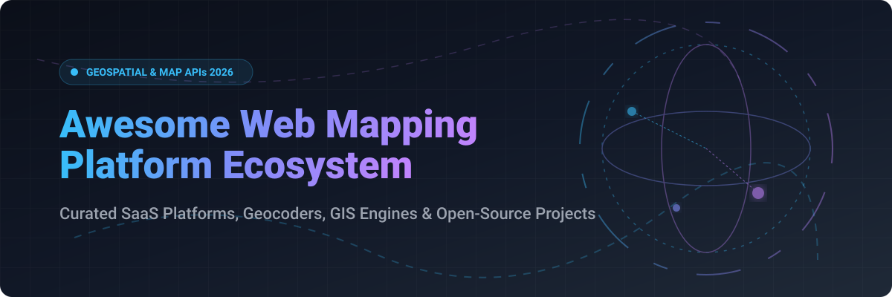

  

  
  
  
  
  

---

# 🗺️ Awesome Web Mapping Platform Ecosystem 🌐

> **The definitive, SEO-optimized, community-curated directory of SaaS products, cloud geospatial APIs, vector/raster tile servers, location intelligence tools, and open-source mapping engines.**

Welcome to the ultimate guide for developers, GIS professionals, software architects, and data engineers building modern, interactive **web maps**, **geocoding workflows**, **route optimization engines**, and **spatial analysis tools**.

---

## 📌 Executive Summary & Meta Overview

Web mapping powers modern location-based services across mobility, logistics, real estate, weather visualization, and business intelligence. Modern web mapping architectures generally separate into:
- 🎨 **Map Rendering Engines**: WebGL/WebGPU vector tile renderers (e.g., MapLibre GL JS, Mapbox GL JS) and lightweight raster tile renderers (e.g., Leaflet, OpenLayers).
- 📍 **Geocoding & Reverse Geocoding Services**: Converting unstructured addresses to coordinates and vice versa (e.g., Nominatim, Pelias, Photon).
- 🛣️ **Routing & Navigation Engines**: Network pathfinding and turn-by-turn routing (e.g., OSRM, GraphHopper).
- ☁️ **SaaS Location Services**: Cloud geospatial platforms offering APIs, hosted basemaps, live traffic, and satellite imagery (e.g., Google Maps, Azure Maps, Mapbox, Esri).

---

## 📊 SaaS & Hosted Platforms Market Overview

### 📈 Market Size & Industry Dynamics
The global **Web Mapping & Location Intelligence Market** is estimated at **$18.5 Billion – $22.4 Billion (2025/2026)** and is projected to reach **$40+ Billion by 2030** (CAGR ~14%).

### 🧩 Market Fragmentation
The sector is **moderately fragmented**:
- 🏢 **Enterprise Hyperscalers** (Microsoft, Google, Esri) control legacy enterprise mapping, proprietary global points-of-interest (POI) databases, and cloud-bundled GIS workflows.
- ⚡ **Specialized Developer Platforms** (Mapbox, MapTiler, Stadia Maps, HERE, TomTom) capture modern mobile, vector-tile, and high-performance routing workloads.
- 🔓 **Open-Source & Open Data** (MapLibre, Leaflet, OpenStreetMap) provide the infrastructure backbone for self-hosted, cloud-native WebGIS platforms.

---

## 🏢 SaaS & Cloud Mapping Platforms

*Sorted by Company Valuation / Annual Revenue (Descending)*

| Platform / Vendor | Market Scale / Valuation 💰 | Free Tier Limit 🎁 | Starting Paid Pricing 🏷️ | Core Capabilities & Best Use Cases 🛠️ |
| :--- | :--- | :--- | :--- | :--- |
| 🔷 **[Microsoft Azure Maps / Bing Maps](https://www.bingmapsportal.com/)** | **~$3.1 Trillion** *(Market Cap)* | 25,000 transactions / month free | **$0.50 per 1,000 transactions** | Enterprise-grade mapping APIs, spatial analytics, and seamless integration with Azure Cloud ecosystem. |
| 🌐 **[Google Maps Platform](https://mapsplatform.google.com/)** | **~$2.2 Trillion** *(Market Cap)* | 10,000 Essentials map loads / month free | **$2.00 per 1,000 map loads** *(Essentials)* | Industry gold standard for global business coverage, Street View imagery, Places API, and route matrix calculation. |
| 🗺️ **[Esri ArcGIS Online](https://www.esri.com/)** | **~$12.0 Billion** *(Valuation)* | 20,000 geocodes & 20,000 basemap tile requests / month free | **$20.00 / month** *(ArcGIS Builder Tier)* | Dominant enterprise GIS platform offering advanced spatial analytics, layers authoring, and WebGIS app builders. |
| 📍 **[HERE Technologies](https://www.here.com/)** | **~$3.5 Billion** *(Valuation)* | 30,000 transactions / month free | **$1.00 per 1,000 transactions** | Automotive-grade mapping data, HD lane-level maps, fleet telematics, and logistics optimization APIs. |
| 🎨 **[Mapbox](https://www.mapbox.com/)** | **~$1.2 Billion** *(Valuation)* | 50,000 GL JS map loads / month free | **$5.00 per 1,000 GL JS map loads** | Developer favorite for custom-styled vector maps, WebGL rendering, mobile SDKs, and turn-by-turn navigation. |
| 🚗 **[TomTom](https://www.tomtom.com/)** | **~$850 Million** *(Market Cap)* | 200,000 map tile requests & 20,000 geocodes / month free | **$0.50 per 1,000 tile requests** | Autonomous driving maps, live traffic data APIs, and flexible location SDKs built on Orbis maps. |
| 📐 **[MapTiler](https://www.maptiler.com/)** | **~$50 Million** *(Valuation)* | 5,000 map sessions / month free | **$30.00 / month** *(Flex plan: 25,000 sessions)* | OpenStreetMap-based hosted vector tile services, global satellite maps, and self-hosted tile server tools. |
| ⚡ **[Stadia Maps](https://stadiamaps.com/)** | **~$10 Million** *(Valuation)* | 200,000 credits / month free *(non-commercial)* | **$20.00 / month** *(Starter plan: 200k credits)* | Developer-friendly tile hosting, routing, and geocoding services with transparent pricing and BSD SDKs. |

---

## 🔓 Open-Source GitHub Repositories & Libraries

*Sorted by GitHub Stars_Count (Descending)*

| Repository & Ecosystem | GitHub_Stars ⭐ | Primary Purpose & Features ⚡ | License 📄 |
| :--- | :--- | :--- | :--- |
| 🍃 **[Leaflet](https://github.com/Leaflet/Leaflet)** |  | Ultra-lightweight (42 KB) mobile-friendly JavaScript library for interactive raster maps with vast plugin ecosystem. | BSD-2-Clause |
| 🚀 **[CesiumJS](https://github.com/CesiumGS/cesium)** |  | Premier open-source 3D globe and map visualization library using WebGL with 3D Tiles geospatial support. | Apache-2.0 |
| ⚡ **[deck.gl](https://github.com/visgl/deck.gl)** |  | WebGL2 & WebGPU-powered visualization framework for rendering large-scale spatial datasets at 60 FPS. | MIT |
| 🌍 **[OpenLayers](https://github.com/openlayers/openlayers)** |  | High-performance, feature-packed JS mapping library supporting vector tiles, raster layers, WMS, and projection transformations. | BSD-2-Clause |
| 📊 **[Kepler.gl](https://github.com/keplergl/kepler.gl)** |  | Open-source geospatial visual analytics platform built on deck.gl for exploratory data analysis of massive location datasets. | MIT |
| 🗽 **[MapLibre GL JS](https://github.com/maplibre/maplibre-gl-js)** |  | Community-governed TypeScript fork of Mapbox GL JS for fast GPU-accelerated vector map rendering, 3D terrain, and globe view. | BSD-3-Clause |
| 📐 **[Turf.js](https://github.com/turfjs/turf)** |  | Advanced geospatial engine written in JavaScript for spatial algorithms, buffer calculations, and GeoJSON transformations. | MIT |
| 🚘 **[OSRM (Open Source Routing Machine)](https://github.com/Project-OSRM/osrm-backend)** |  | High-performance C++ routing engine designed to run fastest-path calculations over OpenStreetMap road networks. | BSD-2-Clause |
| 🐍 **[GeoLibre](https://github.com/opengeos/GeoLibre)** |  | Lightweight cloud-native GIS platform for rendering geospatial layers across browser, desktop, mobile, and Jupyter Notebooks. | MIT |
| 🚦 **[GraphHopper](https://github.com/GraphHopper/graphhopper)** |  | Fast, memory-efficient Java routing engine for OpenStreetMap road networks with matrix and route optimization support. | Apache-2.0 |
| 🔍 **[Nominatim](https://github.com/osm-search/Nominatim)** |  | Official open-source address search engine and geocoder for OpenStreetMap data. | GPL-2.0 |
| 📍 **[Pelias](https://github.com/pelias/pelias)** |  | Modular, open-source geocoding engine built on top of Elasticsearch for custom regional and global address lookups. | MIT |
| ⚡ **[Photon](https://github.com/komoot/photon)** |  | Open-source geocoder developed by Komoot built on OpenStreetMap data and Elasticsearch for multilingual search. | Apache-2.0 |
| 📊 **[Leaflet for R](https://github.com/rstudio/leaflet)** |  | R interface for creating interactive Leaflet maps directly within R Studio, Shiny apps, and R Markdown documents. | MIT |
| 🏛️ **[MapStore](https://github.com/geosolutions-it/MapStore2)** |  | Modular React & Redux WebGIS platform for building enterprise geoportals, spatial dashboards, and interactive geostories. | BSD-2-Clause |

---

## 🛠️ Key Architectural Decisions: Vector vs. Raster Tiles

| Criteria | 🖼️ Raster Tiles (e.g. Leaflet) | 🎨 Vector Tiles (e.g. MapLibre / Mapbox) |
| :--- | :--- | :--- |
| **Rendering Engine** | Server-rendered PNG/JPEG images | Client-rendered (WebGL/WebGPU) vector geometry |
| **Styling Flexibility** | Static (requires re-rendering images on server) | Dynamic styling in client (dark mode, custom colors) |
| **3D & Globe Capabilities** | Flat 2D maps only | Native 3D buildings, terrain elevation, and globe projection |
| **Bandwidth & Performance** | Higher bandwidth for zooming; fast initial load | Smaller payload size; higher GPU utilization |
| **Best Used For** | Simple web maps, low-power devices | Interactive dashboards, custom branding, high-density data |

---

## 🤝 How to Contribute

Contributions are warmly welcomed! Please follow these steps to add new tools or update existing information:

1. 🍴 **Fork the repository**.
2. 📝 **Edit `README.md`**: Follow the existing tabular structure, providing factual, verified details.
3. 🔍 **Verify links and metrics**: Ensure official documentation links and pricing details are up to date.
4. 🚀 **Submit a Pull Request**: Include a clear summary of additions or edits.

---

## 💖 Support & Sponsorship

Thank you so much for exploring and using the **Awesome Web Mapping Platform** ecosystem directory! 🚀

If you find this repository helpful for your projects, research, or development workflows, please consider supporting the project:

- ⭐ **Star this repository** to help others discover it on GitHub.
- 🍴 **Fork it** to contribute new web mapping platforms or open-source tools.
- 📢 **Share it** with fellow GIS developers, Web engineers, and data teams.
- ☕ **Buy me a coffee**: Support ongoing maintenance and curated updates via the [GitHub Sponsor Dashboard](https://github.com/sponsors/ishandutta2007).

  

---

## 📈 Star History

---

  <b>Built with ❤️ for GIS developers, Web engineers, and Location Intelligence teams worldwide.</b>

